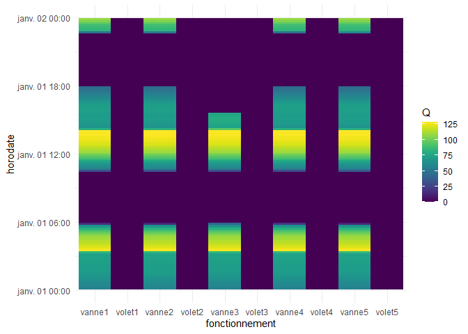
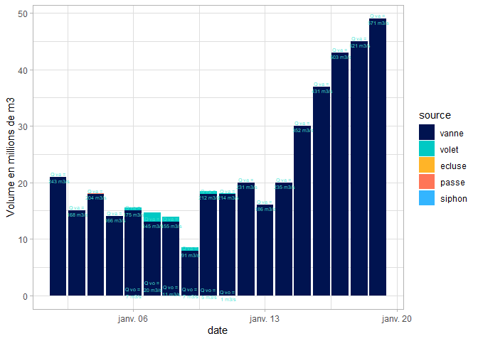

<!-- README.md is generated from README.Rmd. Please edit that file -->

# SIVA

<!-- badges: start -->

[](https://github.com/cedricbriandgithub/SIVA/actions/workflows/R-CMD-check.yaml)
<!-- badges: end -->

L’objectif du package SIVA est de fournir les outils de requetage de la
base de données SIVA, et les principaux graphiques permettant
l’exploitation du barrage d’Arzal et la gestion des inondations.

## Installation

On peut installer le package SIVA à partir de
[GitHub](https://github.com/) avec:

``` r
# install.packages("devtools")
devtools::install_github("https://github.com/Eaux-et-Vilaine/SIVA")
```

Attention pour l’instant le statut de SIVA est private. Contacter Cédric
pour les droits.

## Exemple de calcul des débits

Exemple d’utilisation de SIVA :

``` r

library(SIVA)
#> Le chargement a nécessité le package : stacomirtools
#> Le chargement a nécessité le package : RODBC
#> Le chargement a nécessité le package : DBI
#> Le chargement a nécessité le package : pool
library(dplyr)
#> 
#> Attachement du package : 'dplyr'
#> Les objets suivants sont masqués depuis 'package:stats':
#> 
#>     filter, lag
#> Les objets suivants sont masqués depuis 'package:base':
#> 
#>     intersect, setdiff, setequal, union
# Pour le chargement des débits voir ci-dessous, chargement,
# sinon on peut tester à partir des jeux de données dat2001, dat2003, dat2019.

rawdata2020 <- SIVA::rawdata2020

# pour un accès au tableau des variables : 
data(variable)
head(variable)
#>    tag tagstation            libelle minstation maxstation minpc maxpc format
#> 1 1000         10        Niveau Oust          0          1     0     1      2
#> 2 1005         10        débit total          0          1     0     1      2
#> 3 1006         10  Consigne de d?bit          0          1     0     1      2
#> 4 1007         10     Pression Amont          0          1     0     1      2
#> 5 1008         10      Pression Aval          0          1     0     1      2
#> 6 1009         10 Compteur principal          0          1     0     1      2
#>   unite        tablehisto        tablebilan categorie tag_type_domaine
#> 1     m   B_AUCFER_NIVEAU   C_AUCFER_NIVEAU         7                1
#> 2          B_AUCFER_DEBIT    C_AUCFER_DEBIT        16                0
#> 3       B_AUCFER_CONSIGNE C_AUCFER_CONSIGNE        16                0
#> 4       B_AUCFER_PRESSION C_AUCFER_PRESSION        16                0
#> 5       B_AUCFER_PRESSION C_AUCFER_PRESSION        16                0
#> 6       B_AUCFER_COMPTEUR C_AUCFER_COMPTEUR        16                0
#>   tag_domaine tag_sous_domaine tag_bassin tag_sous_bassin tag_sous_bassin_loc
#> 1           2                0          2               8                   0
#> 2           0                0          0               0                   0
#> 3           0                0          0               0                   0
#> 4           0                0          0               0                   0
#> 5           0                0          0               0                   0
#> 6           0                0          0               0                   0
# variables de débit
data(debit)
head(debit)
#> # A tibble: 6 × 6
#>   code                         tag tagstation libelle           unite tablehisto
#>   <chr>                      <dbl>      <dbl> <chr>             <chr> <chr>     
#> 1 ile_aux_pies_debit          3100         31 Débit Oust (Ile … m³/s  B_ILE_AUX…
#> 2 siphon_debit_1              1528         15 Débit du siphon 1 l/s   B_SIPHON_…
#> 3 siphon_debit_2              1565         15 Débit du siphon 2 l/s   B_SIPHON_…
#> 4 pont_de_cran_debit          1900         19 Débit au Pont de… m³/s  B_PONT_DE…
#> 5 arzal_debit_vilaine_estime  2515         25 Débit Vilaine es… m³/s  B_BARRAGE…
#> 6 arzal_debit_passe           2523         25 Débit passe       m³/s  B_BARRAGE…
# variables de niveau
data(niveau)
head(niveau)
#> # A tibble: 6 × 7
#>   code              tag tagstation libelle           unite tablehisto tablebilan
#>   <chr>           <dbl>      <dbl> <chr>             <chr> <chr>      <chr>     
#> 1 vilaine_barrage  2507         25 Vilaine à Arzal   NGF   B_BARRAGE… C_BARRAGE…
#> 2 mer_barrage      2508         25 Mer à Arzal       NGF   B_BARRAGE… C_BARRAGE…
#> 3 redon_ecluse     2100         21 Vilaine à l'éclu… m     B_REDONEC… C_REDONEC…
#> 4 aucfer           1000         10 Oust à Aucfer     m     B_AUCFER_… C_AUCFER_…
#> 5 redon_port        500          5 Vilaine historiq… m     B_REDONPO… C_REDONPO…
#> 6 redon_amont       600          6 Vilaine à l'amon… m     B_REDONAM… C_REDONAM…
# correction des données de débit : attention la première ligne avec des données de volumes 
# deviendra NA. Tapper ? traitement_siva pour plus d'information sur la fonction
cordata2020 <- traitement_siva(dat=rawdata2020)

# Débit du barrage, tapper ? debit_total et ? debit_journalier pour plus d'informations

Q12345 <- debit_total(param, param0 = param, dat=cordata2020)
Q12345$tot_vol <- cordata2020$tot_vol # volume total au barrage d'Arzal

 plotly_journalier_vanne_volet(date = "2020-01-01", debit_traite=Q12345, is_plotly=FALSE)
```



``` r

# Débits journaliers

Qj <- debit_journalier(debit_barrage=cordata2020, type = "recalcule")
Q2j <- debit_journalier(debit_barrage=cordata2020, type = "barrage_volume")
Q3j <- debit_journalier(debit_barrage=cordata2020, type = "barrage_debit")

QV <- bind_cols(Qj, Q2j %>% select(-date), Q3j %>% select(-date))     
plotly_volume_jour(QV=QV, is_plotly=FALSE)
#> Warning: Ignoring unknown aesthetics: customdata
```



## Chargement des données depuis la base

Pour le bon fonctionnement de SIVA, il faut avoir définit les variables,
`mainpass`, `hostmysql`,`pwdmysql`,`umysql` dans Rprofile.site, soit les
charger à partir d’un .yml. Dans SIVA shiny les variables sont définies
à l’aide de

``` r
 get_golem_config("dbnamemysql.")
```

la variable est lue dans inst/app/golem-config.yml L’utilisateur mysql a
des droits en lecture seulement.

``` r
if (interactive()){
  if (!exists("mainpass")) mainpass <- getPass::getPass(msg = "main password")
  if (!exists("hostmysql")) {
    hostmysql. <- getPass::getPass(msg = "Saisir host")
    # ci dessous pour ne pas redemander au prochain tour
    hostmysql <- encrypt_string(string = hostmysql., key = mainpass)
  } else {
    hostmysql. <- decrypt_string(string = hostmysql, key = mainpass)
  }
  if (!exists("pwdmysql")) {
    pwdmysql. <- getPass::getPass(msg = "Saisir password")
    pwdmysql <- encrypt_string(string = pwdmysql., key = mainpass)
  }  else {
    # pass should be loaded
    pwdmysql. <- decrypt_string(string = pwdmysql, key = mainpass)
  }
  if (!exists("umysql")) {
    umysql. <- getPass::getPass(msg = "Saisir user")
    umysql <- encrypt_string(string = umysql., key = mainpass)
  } else {
    umysql. <- decrypt_string(string = umysql, key = mainpass)
  }
# attention il faut avaoir définit mainpass <- "xxxxx"
  
  pool <- pool::dbPool(
      drv = RMariaDB::MariaDB(),
      dbname = "archive_IAV",
      host = hostmysql.,
      username = umysql.,
      password = pwdmysql.,
      port=3306
  )
  
  
  system.time(debit_barrage <-
          load_debit_barrage (debut = as.POSIXct(
                  strptime("2018-01-01 00:00:00", format = "%Y-%m-%d %H:%M:%S")
              ),
              fin = as.POSIXct(
                  strptime("2018-01-10 00:00:00", format = "%Y-%m-%d %H:%M:%S")
              ),
              con=pool))
#> Table volet1(b_barrage_volet1_hauteur:2555), chargement de 1288 lignes 
#> Table volet2(b_barrage_volet2_hauteur:2556), chargement de 1288 lignes 
#> Table volet3(b_barrage_volet3_hauteur:2557), chargement de 1288 lignes 
#> Table volet4(b_barrage_volet4_hauteur:2558), chargement de 1288 lignes 
#> Table volet5(b_barrage_volet5_hauteur:2559), chargement de 1288 lignes 
#> Table vanne1(b_barrage_vanne1_hauteur:2509), chargement de 1288 lignes 
#> Table vanne2(b_barrage_vanne2_hauteur:2510), chargement de 1288 lignes 
#> Table vanne3(b_barrage_vanne3_hauteur:2511), chargement de 1288 lignes 
#> Table vanne4(b_barrage_vanne4_hauteur:2512), chargement de 1288 lignes 
#> Table vanne5(b_barrage_vanne5_hauteur:2513), chargement de 1288 lignes 
#> Table debit_vilaine_estime(b_barrage_debit:2515), chargement de 1288 lignes 
#> Table debit_passe(b_barrage_debit:2523), chargement de 1288 lignes 
#> Table debit_moyen_cran(b_pont_de_cran_debit:1900), chargement de 1288 lignes 
#> Table tot_vol_barrage(b_barrage_volume:2550), chargement de 1288 lignes 
#> Table tot_vol_passe(b_barrage_volume:2551), chargement de 1288 lignes 
#> Table tot_vol_siphon(b_barrage_volume:2552), chargement de 1288 lignes 
#> Table tot_vol_volet(b_barrage_volume:2553), chargement de 1288 lignes 
#> Table tot_vol_ecluse(b_barrage_volume:2554), chargement de 1288 lignes 
#> Table niveauvilaine(b_passeapoisson_niveauvilaine:2519), chargement de 1288 lignes 
#> Table niveaumer(b_passeapoisson_niveaumer:2520), chargement de 1288 lignes 
#> Table niveauvilaineb(b_barrage_niveau:2507), chargement de 1288 lignes 
#> Table niveaumerb(b_barrage_niveau:2508), chargement de 1288 lignes 
#> Table debit_siphon_1(b_siphon_debit:1528), chargement de 1288 lignes 
#> Table debit_siphon_2(b_siphon_debit:1565), chargement de 1288 lignes 
#> Table debit_vanne1(b_barrage_debit:2571), chargement de 1288 lignes s
#> Table debit_vanne2(b_barrage_debit:2572), chargement de 1288 lignes 
#> Table debit_vanne3(b_barrage_debit:2573), chargement de 1288 lignes 
#> Table debit_vanne4(b_barrage_debit:2574), chargement de 1288 lignes 
#> Table debit_vanne5(b_barrage_debit:2575), chargement de 1287 lignes 
#>   3.41


} # end if interactive
```

Pour plus d’exemples sur le chargement des données télécharger
<https://github.com/Eaux-et-Vilaine/SIVA/raw/main/vignettes/articles/SIVA_plot.html>

``` r
vignette("fonctions-de-debit",package="SIVA")
vignette("database-tools",package="SIVA")
```

Pour extraire les données du barrage dans un csv voir : vignette/extraction_donnees_barrage.qmd


## Pour aller plus loin

<https://github.com/Eaux-et-Vilaine/SIVAshiny>

## Code de conduite

Veuillez noter que le projet SIVA suit le code de conduite des
contributeurs [Contributor Code of
Conduct](https://contributor-covenant.org/version/2/1/CODE_OF_CONDUCT.html).
En contribuant à ce projet, vous acceptez d’en respecter les termes.
